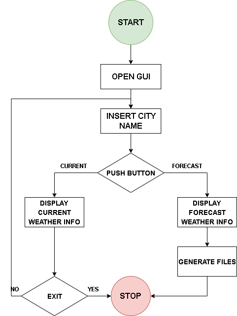

# Weather App

## About This Project

The Python application offers the possibility for a user to access general information about the state of the weather. 
It is quick to access and generates information in a friendly result, easy to understand. 
It provides the opportunity to find out the current weather or a short forecast for 5 days, based on a city name. 
The application is able to communicate with an exterior source. 
It connects to a data source via API and extracts data with reference to the weather conditions.
The API pasted from the website: https://www.weatherbit.io/api/weather-current, returns current conditions from reporting 
weather stations. It will return the nearest and most recent observation.  

## Architecture Diagram

## Process Flow Diagram

- The user must enter the city name which is interested in to find out information about.
Then, the user can press one of two buttons throughout can find:
    >**the current weather**   or
    >
    >**5 days forecast weather**

## Built With
- Python
- REST API
- tkinter
- Poetry

